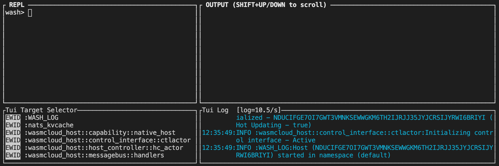

We'll be taking a tour through some of the most common activities in the wasmcloud ecosystem, like starting and configuring [actors](../../reference/host-runtime/actors/) and [capability providers](../../reference/host-runtime/capabilities/).

### Prerequisites
In order to follow this guide, you'll need a few things:
- `wash` (installation covered on [the previous page](../installation))
- [nats-server](https://docs.nats.io/nats-server/installation) **OR** [docker](https://docs.docker.com/engine/install/), recommended with [docker-compose](https://docs.docker.com/compose/install/)

### Starting NATS
[NATS](https://nats.io/) is a message broker used by wasmcloud's self-managing [lattice](../../reference/lattice/) network.

In a terminal window, use one of the following options to launch `nats-server` locally. We recommend using `docker-compose` as it will also launch services that are used in other places in this documentation.

{}
   {}
    # This file is located in the wash repository under tools/
    cat <<EOF > docker-compose.yml
    version: "3"
    services:
      registry:
        image: registry:2
        ports:
        - "5000:5000"
      nats:
        image: nats:2.1.9
        ports:
        - "6222:6222"
        - "4222:4222"
        - "8222:8222"
      redis:
        image: redis:6.0.9
        ports:
        - "6379:6379"   
    EOF
    docker-compose up
   {}
   {}
    docker run -p 4222:4222 -ti nats:latest
   {}
   {}
    nats-server -a 0.0.0.0 -p 4222
   {}
 {}

### Running your first wasmcloud host
In a separate terminal window, run the following command to launch an interactive wasmcloud REPL environment, including a preconfigured wasmcloud host:
```shell
wash up
```
At any time, you can type `help` to see a printed list of subcommands in the log output window in the bottom-right pane. To exit the repl, you can type `exit`, `logout`, `q` or `:q!`. For the best experience using `wash up`, we recommend a terminal size of at least `250x50` characters. A smaller window size may lead to line wrapping or truncation that can make output difficult to read.


To see a list of running hosts, run the following command in the REPL:
```shell
ctl get hosts
```
You should see one host running, and you can view its inventory by running the following command with the **Host ID** found in the Output window:
```shell
ctl get inventory NBMRMKEL...
```
You'll see output similar to the following (public key output truncated for documentation):
```shell
               Host Inventory (NBMRMKELSYA645ZBGN6AEYJU6GV...)                
                                                                                                        
hostcore.os                                                      macos                                        
hostcore.osfamily                                                unix                                         
hostcore.arch                                                    x86_64                                       
repl_mode                                                        true                                         
                          No actors found                                             
                                                                                                        
Provider ID               Link Name                  Image Reference   
VDHPKGFKDI34Y4RN4PWWZH... default                    N/A               
VAHNM37G4ARHZ3CYHB3L34... __wasmcloud_lattice_cache  N/A               
```
Currently on this host, we have a few labels that show the environment this host is running on, and two default providers. The first, starting with `VDHPK`, is the `extras` provider, which provides an interface for wasmcloud resources to generate random numbers, GUIDS, etc. The second, starting with `VAHNM`, is the [lattice](../../reference/lattice/) cache provider, which provides a distributed cache to all hosts running in this lattice. We'll talk more about what a lattice is in the [Platform Builder](../../platform-builder) section of the documentation.

#### Running an actor
We can start scheduling actors and providers right away on this host using the `ctl start` command. To begin, we'll start our `Echo` sample actor. Run the following command to start the `Echo` actor from the wasmcloud registry:
```shell
ctl start actor wasmcloud.azurecr.io/echo:0.2.0
```
The `Echo` sample actor has a single operation `HandleRequest`, which will respond to a delivered HTTP Request with an identical response that "echoes" the request sent.

#### Running a capability provider
In order for this actor to receive HTTP requests, we're going to need to start the `HTTP Server` capability provider. Actors are signed WebAssembly modules, and they can have embedded claims declaring their ability to communicate with capability providers like the `HTTP Server`.
```shell
ctl start provider wasmcloud.azurecr.io/httpserver:0.11.1
```
Let's take a look at our host's inventory now. You can either type the command above again or use the `UP/DOWN` arrow keys to navigate to the previous command. It should look something like this (some output truncated for documentation):
```shell
               Host Inventory (NBMRMKELSYA645ZB...)                           
                                                                                                                              
hostcore.osfamily                                           unix                                                              
hostcore.os                                                 macos                                                             
hostcore.arch                                               x86_64                                                            
repl_mode                                                   true                                                              
                                                                                                                              
Actor ID       Image Reference                                                   
MBCFOPM6JW2... wasmcloud.azurecr.io/echo:0.2.0                                         
                                
Provider ID    Link Name        Image Reference                        
VDHPKGFKDI3... default          N/A                                    
VAHNM37G4AR... __wasmcloud_...  N/A                                    
VAG3QITQQ2O... default          wasmcloud.azurecr.io/httpserver:0.11.1 
```

#### Linking actors and capability providers
Now your `Echo` actor and `HTTP Server` providers are running, but they aren't connected. In order to allow the actor and provider to communicate, we need to `link` them together, which we do using their respective Public Keys (shown in the Inventory as `Actor ID` and `Provider ID`).

You can use the following command to `link` your actor and provider.
```shell
ctl link MBCFOPM6JW2APJLXJD3Z5O4CN7CPYJ2B4FTKLJUR5YR5MITIU7HD3WD5 VAG3QITQQ2ODAOWB5TTQSDJ53XK3SHBEIFNK4AYJ5RKAX2UNSCAPHA5M wasmcloud:httpserver PORT=8080
```
**Note:** If you're running MacOS you might receive a message asking if you want `wash` to receive incoming network connections. You should click "Allow", this is just setting up the provider's local HTTP server to listen on port 8080. This creates a temporary firewall rule to allow us to locally make HTTP requests to this HTTP server.
Once you see that the link has been advertised, you are ready to send a request to your actor.

#### Interacting with your actor
In another terminal window (not the REPL), run the following command:
```shell
curl localhost:8080/echo
```
In response, you should receive your request object (notice the path argument):
```shell
{"method":"GET","path":"/echo","query_string":"","headers":{"host":"localhost:8080","user-agent":"curl/7.64.1","accept":"*/*"},"body":[]}
```
Feel free to try out different methods of making a request to your actor, including adding headers or using a different HTTP method to see different outputs.

Instead of using `curl`, you can also _directly invoke_ actors' registered functions using `ctl call`. As mentioned before, the function that "echoes" this HTTP request is registered with the operation `HandleRequest`, and we can make this request directly to the actor if we supply the correct parameters.

Here's an example of using `call` in the REPL to mimic our above `curl`. Note that this is not interacting with the `HTTP Server` provider, and we don't need it to be running or linked for this operation to succeed:
```shell
ctl call MBCFOPM6JW2APJLXJD3Z5O4CN7CPYJ2B4FTKLJUR5YR5MITIU7HD3WD5 HandleRequest {"method": "GET", "path": "/echo", "body": "", "queryString":"","header":{}}
```
⚠️ `call` only works here because the JSON payload we pass as an argument is _exactly_ the same in terms of fields, shape and data types as the payload that the actor is expecting. If a field is missing, or a data type is incorrect, the actor will reject the call.
Our output will look something like this:
```shell
Call response (raw): ��statusCode�Ȧstatus�OK�header��body�S{"method":"GET","path":"/echo","query_string":"","headers":{},"body":[]}
```
Because the actor isn't actually returning JSON, the return payload has some characters that the terminal doesn't know how to interpret from its bytes[^1]. However you can still see the response body which contains our exact "echoed" request.

That covers the basics of wasmcloud development in our REPL environment. To learn more about actors, providers, and more concepts on wasmcloud, continue on to the [App Development](../../app-dev) or [Platform Building](../../platform-builder) sections depending on your interests.

[^1]: We're using [msgpack](https://msgpack.org/) to serialize arbitrary byte payloads when sending information to/from actors. Due to this serialization format, the bytes that are sent to and from actors must be deserialized with the shape of the object already known, and in the case of `ctl call` we are doing our best guess as to what the return payload is going to look like. As you can see when using `curl`, when we know the shape of the data (an HTTP response) we're able to fully deserialize the actor's response.