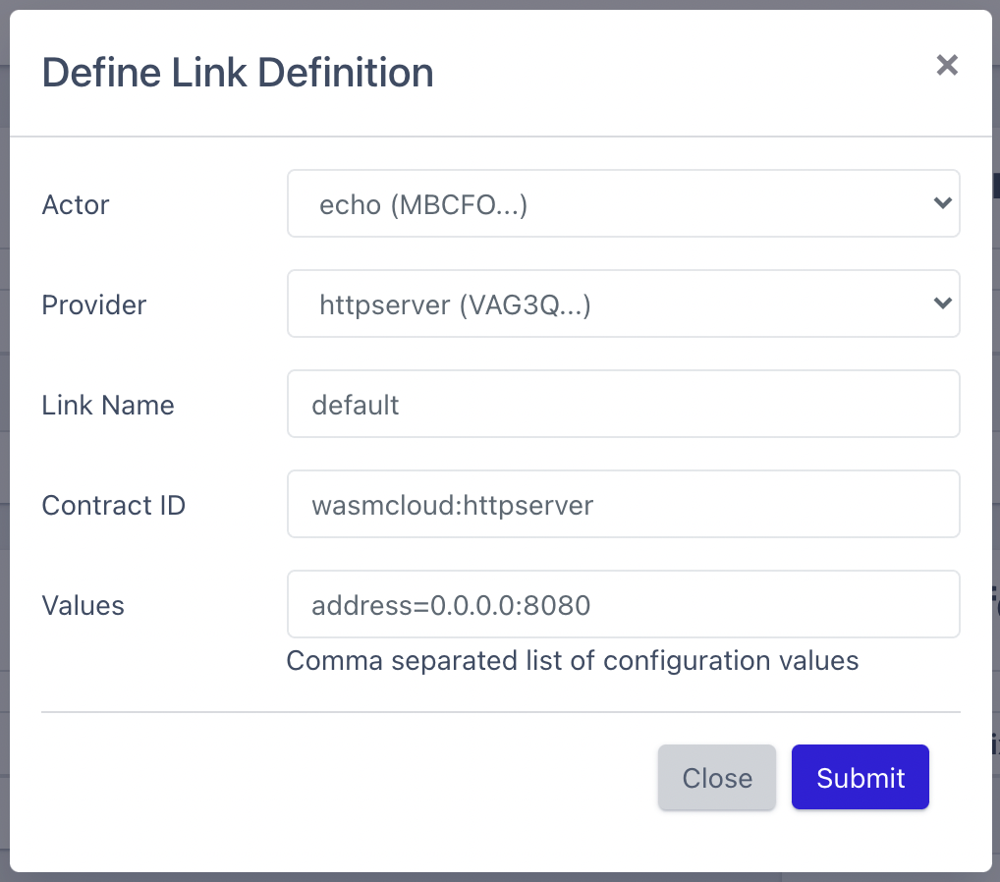

In this guide, we'll be taking a tour through some of the most common activities in the wasmCloud ecosystem, like starting and configuring [actors](../../reference/host-runtime/actors/) and [capability providers](../../reference/host-runtime/capabilities/). We will save the guides for actually writing code for actors and providers for later, after you're familiar with the tooling and starting/stopping the runtime.

### Prerequisites
In order to follow this guide, you'll need `wash` and the wasmCloud OTP host runtime (installation covered on [the previous page](../installation)).

### Start NATS
Make sure that you have NATS running. The wasmCloud host requires that you run NATS with [JetStream](https://docs.nats.io/jetstream/jetstream) enabled, so you'll need to modify the start command to include either `-js` or `--jetstream` when you start the server:

```shell
nats-server -js
```

NATS will greet you with some fairly obvious ASCII artwork in the console log when you start it with JetStream enabled. At the time this documentation was written, we used **v2.3.4** of the NATS server. Yours should be _at least_ that version.

### Running your First wasmCloud host

If you haven't already launched an instance of the wasmCloud host, you can do so now either by launching it as a server (daemon) or as a foreground process, or using the docker image. The following starts the host as a server/daemon:

```shell
./bin/wasmcloud_host start
```

_No news is good news_. If everything went right, you should see nothing. You'll know that your wasmCloud host is running by opening a browser tab to the URL [http://localhost:4000](http://localhost:4000). This is the _wasmCloud dashboard_, a GUI that you will use quite often as you learn to build distributed applications in this ecosystem.


Make sure that you've got the port **4000** available or you likely won't see the wasmCloud dashboard. If you need to change the port number, you can set the environment variable `PORT` to the new number and re-start the host with that environment variable in scope.

To see a list of running hosts, issue the following command in a terminal window (`wash` should be in your path):
```shell
wash ctl get hosts
⢈⠩  Retrieving Hosts ...

  Host ID                                                    Uptime (seconds)  
  NCPGH5CVPO3BAZ5OSQKXYHDKPBT3JXLG5EAOTG7XOXUWJ6AHZCFT57SI   711    
```

You should see one host running, and you can view its inventory by running the following command with the **Host ID** found in the Output window (make sure you use _your_ host and not the one in this guide):

```shell
wash ctl get inventory NCPGH5CVPO3BAZ5OSQKXYHDKPBT3JXLG5EAOTG7XOXUWJ6AHZCFT57SI
```
You'll see output similar to the following (your host key will be different):

```shell
 Host Inventory (NCPGH5CVPO3BAZ5OSQKXYHDKPBT3JXLG5EAOTG7XOXUWJ6AHZCFT57SI)  
                                                                              
  hostcore.os                           linux                                 
  hostcore.osfamily                     unix                                  
  hostcore.arch                         x86_64                                
                                                                              
  No actors found                                                             
                                                                              
  No providers found  
```

Currently on this host, we have a few labels that show the environment this host is running on, and no capability providers. All wasmCloud hosts set the `hostcore.*` labels, which are available in auctions (discussed in the reference guide).

The terminal output you've seen so far is also reflected in the GUI. Throughout our guides and tutorials we may alternate between the wasmCloud dashboard UI and terminal-based CLI to reinforce that everything you can do in one view, you can do in the other.

#### Running an Actor

We can start scheduling actors and providers right away on this host using the `wash ctl start` command, but we'll use the dashboard UI for now. Using the web UI, click the **Start Actor** button and choose the _From Registry_ option. When prompted for an [OCI](https://opencontainers.org/posts/announcements/2021-05-04-oci-dist-spec-v1/) reference URL, enter `wasmcloud.azurecr.io/echo:0.2.1` and for now just choose **1** for the number of replicas. After just a few moments, you should now have a running actor in your environment. As the system conducts a periodic health check, the actor's status should change from `Awaiting` to `Healthy`.


#### Running a Capability Provider

In order for this actor to receive HTTP requests, we're going to need to start the `HTTP Server` capability provider. Actors are signed WebAssembly modules, and as such they have embedded claims declaring their ability to communicate with capability providers like the `HTTP Server`. Actors cannot communicate with any capability provider for which they have not been signed.

Let's use the `wash` CLI to inspect the set of capabilities this actor has:

```shell
wash claims inspect wasmcloud.azurecr.io/echo:0.2.1
                                                                          
                               Echo - Module                              
  Account       ACOJJN6WUP4ODD75XEBKKTCCUJJCY5ZKQ56XVKYK4BEJWGVAOOQHZMCW  
  Module        MBCFOPM6JW2APJLXJD3Z5O4CN7CPYJ2B4FTKLJUR5YR5MITIU7HD3WD5  
  Expires                                                          never  
  Can Be Used                                                immediately  
  Version                                                      0.2.1 (2)  
  Call Alias                                                   (Not set)  
                               Capabilities                               
  HTTP Server                                                             
                                   Tags                                   
  None
```

To start the HTTP server capability provider, again use the web UI and click **Start Provider** and then select _From Registry_. Supply the OCI URL `wasmcloud.azurecr.io/httpserver:0.13.1` and leave the _link name_ set to `default`. You should now see this capability provider running (don't worry that our screenshot shows it as `unhealthy`, yours should switch to `healthy` as soon as an internal heartbeat takes place).


Let's take a look at our host's inventory now. You can now re-run the `wash ctl get inventory` command and you should see something like the following (again, your host ID will differ):

```shell
Host Inventory (NCPGH5CVPO3BAZ5OSQKXYHDKPBT3JXLG5EAOTG7XOXUWJ6AHZCFT57SI)                                 
                                                                                                                                            
  hostcore.os                  linux                                                      
  hostcore.osfamily            unix                                                       
  hostcore.arch                x86_64                                                     
                                                                                                                                            
  Actor ID                                                    Name               Image Reference                                            
  MBCFOPM6JW2APJLXJD3Z5O4CN7CPYJ2B4FTKLJUR5YR5MITIU7HD3WD5    N/A                wasmcloud.azurecr.io/echo:0.2.1                            
                                                                                                                                            
  Provider ID                                                 Name               Link Name          Image Reference                         
  VAG3QITQQ2ODAOWB5TTQSDJ53XK3SHBEIFNK4AYJ5RKAX2UNSCAPHA5M    N/A                default            wasmcloud.azurecr.io/httpserver:0.13.1
```

#### Linking Actors and Capability Providers
Now your `Echo` actor and `HTTP Server` providers are running, but they aren't connected. Since the HTTP server provider hasn't been _linked_ to any actor yet, it isn't yet running a web server. In order to allow the actor and provider to communicate, we need to `link` them together, which we do using their respective Public Keys (shown in the Inventory as `Actor ID` and `Provider ID`).

Go back to the web UI and click **Define Link**. The web UI remembered the public keys of the actors and providers running, so you just need to pick them out of a dropdown as shown:



Once you see that the link has been added to the dashboard UI (you can also use `wash` to query this from the lattice), you are ready to send a request to your actor.

#### Interacting with your Actor
In another terminal window, run the following command:
```shell
curl localhost:8080/echo
```
In response, you should receive your request object (notice the path argument):

```shell
{"method":"GET","path":"/echo","query_string":"","headers":{},"body":[]}
```

Feel free to try out different methods of making a request to your actor, including adding headers or using a different HTTP method to see different outputs.

Instead of using `curl`, you can also _directly invoke_ actors' registered functions using `wash call`. The function that "echoes" this HTTP request is a part of the interface `wasmcloud:httpserver` and has the operation name `HandleRequest`. We can make this request directly to the actor if we supply the correct parameters.

Here's an example of using `wash call` to mimic our previous `curl` command. Note that this is not interacting with the `HTTP Server` provider, and we don't need it to be running or linked for this operation to succeed:

```shell
wash call MBCFOPM6JW2APJLXJD3Z5O4CN7CPYJ2B4FTKLJUR5YR5MITIU7HD3WD5 HandleRequest '{"method": "GET", "path": "/echo", "body": "", "queryString":"","header":{}}'
```
⚠️ `call` only works here because the JSON payload we pass as an argument is _exactly_ the same in terms of fields, shape, and data types as the payload that the actor is expecting. If a field is missing, or a data type is incorrect, the actor will reject the call.

Our output will look something like this:

```shell
Call response (raw): ��statusCode�Ȧstatus�OK�header��body�H{"method":"GET","path":"/echo","query_string":"","headers":{},"body":[]}
```

Because the actor isn't actually returning JSON, the return payload has some characters that the terminal doesn't know how to interpret from its bytes[^1]. However, you can still see the response body which contains our exact "echoed" request. Note that there's a more "human" friendly way of invoking actors using the dashboard's web UI.

Congratulations! You've made it through the first guide to wasmCloud. You should now feel comfortable exploring the ecosystem, starting and stopping the host runtime, interacting with the wasmCloud dashboard web UI, and interacting with lattices using the `wash` command line tool.

To learn more about actors, providers, and more concepts on wasmcloud, continue on to the [App Development](../../app-dev) or [Platform Building](../../platform-builder) sections depending on your interests.

[^1]: We're using [msgpack](https://msgpack.org/) to serialize arbitrary byte payloads when sending information to/from actors. Due to this serialization format, the bytes that are sent to and from actors must be deserialized with the shape of the object already known, and in the case of `wash call` we are doing our best guess as to what the return payload is going to look like. As you can see when using `curl`, when we know the shape of the data (an HTTP response) we're able to fully deserialize the actor's response.